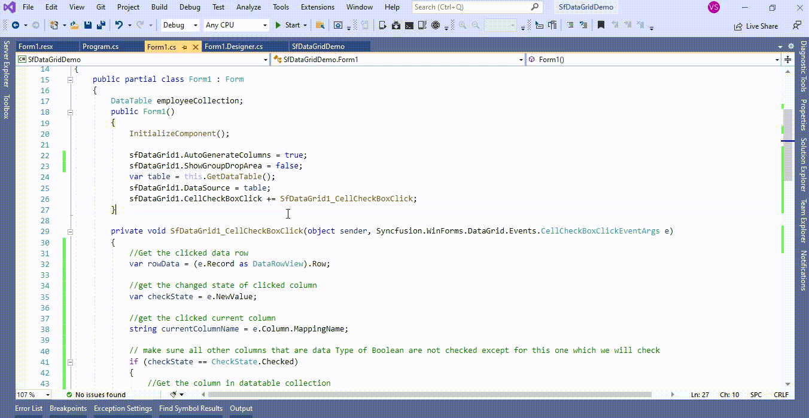
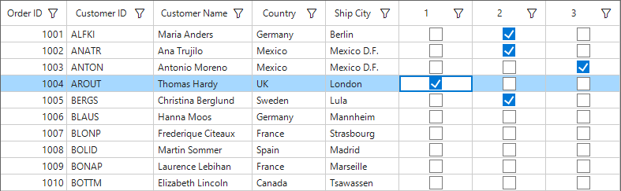

# How to uncheck the other checkboxes in the row by clicking on any one checkbox in the same row in WinForms DataGrid (SfDataGrid)?

## About the sample
This example illustrates how to uncheck the other checkboxes in the row by clicking on any one checkbox in the same row in [WinForms DataGrid](https://www.syncfusion.com/winforms-ui-controls/datagrid) (SfDataGrid)? 

[WinForms DataGrid](https://www.syncfusion.com/winforms-ui-controls/datagrid) (SfDataGrid) does not provide the direct support to uncheck the other checkboxes in the row by clicking on any one checkbox in the same row. You can uncheck the other checkboxes in the row by clicking on any one checkbox in the same row by customization the [CellCheckBoxClick](https://help.syncfusion.com/cr/windowsforms/Syncfusion.WinForms.DataGrid.SfDataGrid.html#Syncfusion_WinForms_DataGrid_SfDataGrid_CellCheckBoxClick) event in [WinForms DataGrid](https://www.syncfusion.com/winforms-ui-controls/datagrid) (SfDataGrid).

```C#

sfDataGrid1.CellCheckBoxClick += SfDataGrid1_CellCheckBoxClick;

private void SfDataGrid1_CellCheckBoxClick(object sender, Syncfusion.WinForms.DataGrid.Events.CellCheckBoxClickEventArgs e)
{
      //Get the clicked data row
      var rowData = (e.Record as DataRowView).Row;

      //get the changed state of clicked column
      var checkState = e.NewValue;

      //get the clicked current column
      string currentColumnName = e.Column.MappingName;

      // make sure all other columns that are data Type of Boolean are not checked except for this one which we will check
      if (checkState == CheckState.Checked) 
      {
          //Get the column in datatable collection
          foreach (DataColumn dc in employeeCollection.Columns)
          {
                 if (dc.ColumnName != currentColumnName && dc.DataType == typeof(Boolean))
                 {
                    rowData[dc.ColumnName] = false;
                 }
                 else if (dc.ColumnName == currentColumnName)
                 {
                      rowData[dc.ColumnName] = true;
                 }
          }
      }
}

```



The following screenshot shows the uncheck the other checkboxes in the row by clicking on any one checkbox in the same row,



Take a moment to peruse the [WinForms DataGrid - GridCheckBoxColumn](https://help.syncfusion.com/windowsforms/datagrid/columntypes#gridcheckboxcolumn) documentation, where you can find about GridCheckBoxColumn with code examples.

## Requirements to run the demo
Visual Studio 2015 and above versions
